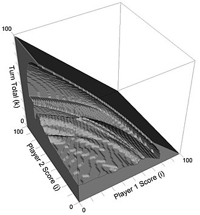

<style>
.list-group {
  font-size:medium
}
</style>

<style>
.list-group-item.active, .list-group-item.active:focus, .list-group-item.active:hover {
    background-color: #11bf42;
}
</style>

```{r setup, include=FALSE}
knitr::opts_chunk$set(echo = TRUE) 
```

## 1. De qué va este taller

El juego del cerdo es un juego de reglas sencillas, aunque con estrategias y análisis sorprendentemente complejos. Tiene relevancia como metáfora para muchos problemas aparentemente sencillos que dieron lugar años después a provechosas investigaciones matemáticas y como herramienta de enseñanza utilizada por numerosos educadores para tratar el tema de la estrategia en los juegos.

El juego del cerdo fue descrito por primera vez en 1945 por John Scarne, un mago estadounidense experto en juegos, cartomago e inventor, a pesar de que el juego se basa en *juegos populares* anteriores con diferentes variaciones. Para jugar a este juego, un jugador tira un dado hasta que sale 1 o hasta que decide *plantarse* y sumar las tiradas de su turno. En caso de que al jugador le salga un 1, no suma ningún punto y el turno pasa al oponente. Gana el primer jugador que alcance 100 o más puntos. Ejemplo: usted saca un 3. Decide tirar otra vez y saca un 1. Entonces no suma puntos y ofrece el dado a su oponente. Este tira la secuencia 3-4-6 y decide plantarse. De este modo sumará 13 puntos a su tanteo y le devolverá el dado.

El juego del cerdo se considera un juego de dados de arriesgar debido a que los jugadores deben decidir si arriesgan lo ganado anteriormente tirando de nuevo para obtener más untos adicionales. En 2004, los científicos informáticos Todd W. Neller y Clifton Presser del Gettysburg College de Pensilvania analizaron el juego del cerdo de forma detallada para dilucidar una estrategia de juego óptima. Utilizando las matemáticas y sirviéndose de gráficos informáticos, descubrieron una estrategia complicada y nada intuitiva ara ganar y demostraron por qué jugar para ganar más puntos en un turno es claramente diferente a jugar para ganar. En lo que respecta a los resultados y las visualizaciones sobre mejores pautas, indicaron de forma poética que *ver el panorama de estas pautas es como ver con claridad por primera vez la suerficie de un planeta lejano, cuando antes tan sólo se habían visto imágenes borrosas*.^[Fuente: El Libro de las Matemáticas. De Pitágoras a la 57ª dimensión. 250 hitos de las matemáticas, de Clifford A. Pickover] 

En este taller vamos a jugar al juego del cerdo y vamos a experimentar diversas estrategias, haciendo simulaciones con R. Vamos a utilizar sentencias muy sencillas y útiles si te vas a introducir en el lenguaje. Si ya eres experto en él, quizás te interese conocer el juego porque es muy interesante. También puedes utilizar este taller para enseñar R si te dedicas a ello.

## 2. Preparación del taller

En ese taller sólo vamos a utilizar una librería llamada `tidyverse`. Si no está instalada en tu PC, lo primero que tendrás que hacer es instalarla ejecutando la siguiente sentencia:

```{r, eval = FALSE}
install.packages("tidyverse")
```

Y luego cargarla:

```{r, message = FALSE, warning=FALSE}
library(tidyverse)
```

## 3. El jugador TIRA5

Vamos a suponer un jugador que como mucho tire siempre 5 veces el dado. Si antes de las 5 tiradas le sale un 1, se *fastidiará* y sumará 0 puntos en la ronda, pero si no saca 1, seguirá tirando hasta un máximo de 5 veces. Vamos a simular una partida de este jugador:


```{r, message = FALSE, warning=FALSE}
max_tiradas <- 5
total_puntos <- 0
evolu_puntos <- numeric()

while(total_puntos < 100){
  parcial <- 0
  tiradas <- 0
  while(tiradas <= max_tiradas){
    resultado <- sample(1:6, 1)
    if (resultado == 1) {
      parcial <- 0
      break
    }else{
      parcial <- parcial + resultado    
      tiradas <- tiradas + 1
      if(total_puntos + parcial >= 100) break
    }
  }
  evolu_puntos <- append(evolu_puntos, parcial)
  total_puntos <- total_puntos + parcial
}

print(paste0("Ha tardado ", length(evolu_puntos), " rondas en ganar"))

```

El código anterior tiene algunas cosas que merece la pena comentar:

* Empieza **asignando valores a 3 variables**: `max_tiradas`, que vale 5 y define la cantidad máxima de veces que va a tirar el jugador, `total_puntos`, que inicializamos en 0 y a la que vamos a ir sumando lo que vaya consiguiendo el jugador conforme avance el juego y `evolu_puntos`, que nos servirá para guardar los diferentes resultados parciales que consiga el jugador en las tiradas.
* La partida está dentro de un bucle `while`, que termina cuando la variable `total_puntos` sea igual o mayor que 100. O sea, haremos que el jugador siga jugando rondas hasta que su puntuación total iguale o supere los 100 puntos.
* Cada vez que empieza el `while` es una iteración nueva (o lo que es lo mismo, una ronda nueva), con lo que tenemos que volver a contar el número de tiradas (`tiradas`) y la puntuación parcial (`parcial`)
* La ronda está dentro de otro bucle `while`, que termina cuando la variable `max_tiradas` sea igual a 5.
* La forma de simular la tirada del dado es con `sample(1:6, 1)`, que extrae un número al azar del 1 al 6.
* Si el número es 1, la variable parcial es cero y termina la ronda. Mientras en el dado no salga 1 y no lleguemos al número máximo de tiradas, seguimos tirando.
* Al final de la ronda actualizamos el valor de `evolu_puntos` pegando el valor del parcial obtenido y de `total_puntos` sumándole dicho parcial al valor anterior que hubiera guardado.

Una de las cosas que hemos ido guardando es la evolución de los parciales que ha obtenido nuestro jugador. Esto nos permite ver cómo ha evolucionado la partida:

```{r, message = FALSE, warning=FALSE}
plot(cumsum(evolu_puntos), 
     type = "l",
     main = "Una partida de TIRA5",
     xlab="Ronda", 
     ylab="Puntos")
```

Date cuenta de que no hemos pintado directamente los parciales obtenidos que hemos ido guardando en el vector `evolu_puntos` sino `cumsum(evolu_puntos)`, que es la suma acumulada de los mismos; esta suma acumulada refleja exactamente lo que el jugador a ido acumulando hasta la ronda correspondiente. 

Algunas preguntas para pensar:

* ¿Por qué nunca decrece la línea del gráfico anterior?
* ¿Cómo se reflejan en el gráfico las rondas en las que el jugador no suma ningún punto?
* ¿Que *pinta* crees que tendría el gráfico con `max_tiradas <- 50`? ¿y con `max_tiradas <- 2`?
* ¿Es mejor tirar 5 veces o tirar 3? Intenta hacerte una idea con el código anterior.

## 4. Primer duelo: TIRA5 contra TIRA3

Ahora que sabemos cómo simular a un jugador que tira un máximo de 5 veces, es fácil enfrentarlo a otro que tire un máximo de 3 veces. Para ello tenemos que *duplicar* el código anterior para que refleje a ambos jugadores. Todas las variables anteriores (`max_tiradas`, `total_puntos`, `evolu_puntos`, `parcial` y `tiradas`) ahora acabarán en `1` o en `2` según se refieran al jugador 1 (que tira un máximo de 5 veces) o al 2 (que tira un máximo de 3).

Cuando se enfrentan dos jugadores es importante tener en cuenta que puede haber empate si ambos superan los 100 puntos en la misma ronda. No sería justo designar ganador al primero que superase los 100 puntos pues eso daría cierta ventaja al jugador que tirase primero. 


```{r, message = FALSE, warning=FALSE}
max_tiradas1 <- 5
max_tiradas2 <- 3

total_puntos1 <- 0
total_puntos2 <- 0

evolu_puntos1 <- numeric()
evolu_puntos2 <- numeric()

while(total_puntos1 < 100 & total_puntos2 < 100){
  
  parcial1 <- 0
  tiradas1 <- 0
  while(tiradas1 <= max_tiradas1){
    resultado <- sample(1:6, 1)
    if (resultado == 1) {
      parcial1 <- 0
      break
    }else{
      parcial1 <- parcial1 + resultado    
      tiradas1 <- tiradas1 + 1
      if(total_puntos1 + parcial1 >= 100) break
    }
  }
  evolu_puntos1 <- append(evolu_puntos1, parcial1)
  total_puntos1 <- total_puntos1 + parcial1
  
  parcial2 <- 0
  tiradas2 <- 0
  while(tiradas2 <= max_tiradas2){
    resultado <- sample(1:6, 1)
    if (resultado == 1) {
      parcial2 <- 0
      break
    }else{
      parcial2 <- parcial2 + resultado    
      tiradas2 <- tiradas2 + 1
      if(total_puntos2 + parcial2 >= 100) break
    }
  }
  evolu_puntos2 <- append(evolu_puntos2, parcial2)
  total_puntos2 <- total_puntos2 + parcial2
  
  
}

ganador <- ifelse(total_puntos1 >= 100 & total_puntos2 >= 100, 
                  "Empate", 
                  ifelse(total_puntos1 > total_puntos2, "TIRA5", "TIRA3"))


print(paste0("Ha ganado el jugador ", ganador, " en ", length(evolu_puntos1), " rondas."))

```

Al igual que antes, podemos ver cómo ha evolucionado la partida para ambos jugadores:

```{r, message = FALSE, warning=FALSE}
ggplot() +
  geom_line(aes(x = 1:length(evolu_puntos1), y = cumsum(evolu_puntos1), col = "TIRA5")) +
  geom_line(aes(x = 1:length(evolu_puntos2), y = cumsum(evolu_puntos2), col = "TIRA3")) +
  scale_x_continuous(breaks=1:max(length(evolu_puntos1), length(evolu_puntos2))) +
  labs(title = "TIRA5 contra TIRA3",
       colour = "",
       x = "Ronda", 
       y = "Puntos")

```

Ahora hemos utilizado otra función para pintar los gráficos, que se llama `ggplot` y es más flexible que la anterior. Te recomendo que hagas muchos gráficos. Es la mejor manera de *entender* los datos. Además, una buena visualización suele ser también una buena manera de mostrar resultados. R es una herramienta extraordinaria para visualizar datos y una de las librerías más importantes para hacerlo es `ggplot2`: es potente, flexible y se actualiza regularmente para incluir nuevas funcionalidades. Su sintaxis puede parecer un poco extraña al principio, pero aquí hay algunos conceptos importantes para tener en cuenta:

* Es realmente importante tener claro el tipo de gráfico que queremos hacer pues para cada uno hay una *geometría* diferente. La función genérica para realizar un gráfico es `ggplot()` y las geometrías se definen con su correspondiente función `geom_`.
* Cada geometría necesita una *estética* que sirve para definir qué datos se utilizarán y cómo. Esto se hace con la función `aes()`, bien dentro de la geometría o de forma genérica dentro de la función `ggplot()`.
* También puedes combinar geometrías. Por ejemplo, combinar barras y líneas en un mismo gráfico. Para hacerlo se usa el operador `+`. Este operador es muy importante: no solo sirve para combinar geometrías sino también para agregar características al gráfico.

La librería `ggplot2` forma parte del `tidyverse`, una colección de librerías eficientes diseñadas para analizar datos de manera coherente, que usamos en este taller.


¿Qué estrategia crees que es la mejor? Simulando una sola partida no podrás tener clara la respuesta. Prueba a ejecutar muchas veces el código y apunta quién gana.

Ahora tendrás más información para emitir una hipótesis pero es muy incómodo lanzar tantas veces el código. Además por muchas veces que lo hagas, siempre tendrás la duda de si tu hipótesis es cierta. Si quisieras ver el resultado de 2000 partidas, lanzarlo a mano no es la mejor estrategia. Pero es muy fácil modificar el código anterior para simular 2000 partidas:

```{r, message = FALSE, warning=FALSE}
max_tiradas1 <- 5
max_tiradas2 <- 3

partidas <- 2000
ganadores <- character()

for (i in 1:partidas)
{
  total_puntos1 <- 0
  total_puntos2 <- 0
  while(total_puntos1 < 100 & total_puntos2 < 100){
    
    parcial1 <- 0
    tiradas1 <- 0
    while(tiradas1 <= max_tiradas1){
      resultado <- sample(1:6, 1)
      if (resultado == 1) {
        parcial1 <- 0
        break
      }else{
        parcial1 <- parcial1 + resultado    
        tiradas1 <- tiradas1 + 1
        if(total_puntos1 + parcial1 >= 100) break
      }
    }
    total_puntos1 <- total_puntos1 + parcial1
    
    parcial2 <- 0
    tiradas2 <- 0
    while(tiradas2 <= max_tiradas2){
      resultado <- sample(1:6, 1)
      if (resultado == 1) {
        parcial2 <- 0
        break
      }else{
        parcial2 <- parcial2 + resultado    
        tiradas2 <- tiradas2 + 1
        if(total_puntos2 + parcial2 >= 100) break
      }
    }
    total_puntos2 <- total_puntos2 + parcial2
  }
  
  ganador <- ifelse(total_puntos1 >= 100 & total_puntos2 >= 100, 
                   "Empate",
                   ifelse(total_puntos1 > total_puntos2, "TIRA5", "TIRA3"))
  
  ganadores <- append(ganadores, ganador)

}
```

Lo que hemos hecho es meter el código anterior dentro de un bucle `for` (otro tipo de bucle, éste realiza exactamente las iteraciones que le digamos, a diferencia del `while`, que termina cuando se consigue algo, con independencia de las iteraciones que se necesiten para conseguirlo). El número de partidas está definido por la variable `partidas`, que vale `2000`. También hemos creado un nuevo vector llamado `ganadores` que nos ha servido para guardar el ganador de cada una de las partidas.

Ahora podemos hacer una tabla para ver quién ha ganado las partidas: 

```{r, message = FALSE, warning=FALSE}
table(ganadores)
```

Parece claro que la estrategia de TIRA5 es mejor que la de TIRA3. Pero, **¿hay alguna estrategia mejor?**

## 5. El jugador CONSIGUE20

Nuestro nuevo jugador se llama CONSIGUE20 y tiene una estrategia distinta. En vez de tirar un número máximo de veces, tirará las que hagan falta hasta que consiga al menos 20 puntos. Veamos una partida de CONSIGUE20:

```{r, message = FALSE, warning=FALSE}
total_puntos <- 0
evolu_puntos <- numeric()
consigue <- 20

while(total_puntos < 100){
  parcial <- 0
  tiradas <- 0
  while(parcial < consigue){
    resultado <- sample(1:6, 1)
    if (resultado == 1) {
      parcial <- 0
      break
    }else{
      parcial <- parcial + resultado    
      tiradas <- tiradas + 1
      if(total_puntos + parcial >= 100) break
    }
  }
  evolu_puntos <- append(evolu_puntos, parcial)
  total_puntos <- total_puntos + parcial
}

print(paste0("Ha tardado ", length(evolu_puntos), " rondas en ganar"))
```

Seguro que has sido capaz de entender cuáles han sido las modificaciones que se han hecho en el código para simular a CONSIGUE20. Vemos gráficamente cómo le ha ido a nuestro jugador en la partida:

```{r, message = FALSE, warning=FALSE}
plot(cumsum(evolu_puntos), 
     type = "l",
     main = "Una partida de CONSIGUE20",
     xlab="Ronda", 
     ylab="Puntos")
```


## 6. Segundo duelo: TIRA5 contra CONSIGUE20

Es hora de que TIRA5 y CONSIGUE20 se batan en un duelo *a muerte*. Las variables que terminan en 1 se refieren a TIRA5 y las que terminan en 2, a CONSIGUE20. Vamos a simular directamente 2000 partidas entre ambos jugadores:

```{r, message = FALSE, warning=FALSE}
partidas <- 2000
max_tiradas1 <- 5
consigue2 <- 20

ganadores <- character()

for (i in 1:partidas)
{
  total_puntos1 <- 0
  total_puntos2 <- 0
  
  while(total_puntos1 < 100 & total_puntos2 < 100){
    
    parcial1 <- 0
    tiradas1 <- 0
    while(tiradas1 <= max_tiradas1){
      resultado <- sample(1:6, 1)
      if (resultado == 1) {
        parcial1 <- 0
        break
      }else{
        parcial1 <- parcial1 + resultado    
        tiradas1 <- tiradas1 + 1
        if(total_puntos1 + parcial1 >= 100) break
      }
    }
    evolu_puntos1 <- append(evolu_puntos1, parcial1)
    total_puntos1 <- total_puntos1 + parcial1
    
    parcial2 <- 0
    tiradas2 <- 0
    while(parcial2 < consigue2){
      resultado <- sample(1:6, 1)
      if (resultado == 1) {
        parcial2 <- 0
        break
      }else{
        parcial2 <- parcial2 + resultado    
        tiradas2 <- tiradas2 + 1
        if(total_puntos2 + parcial2 >= 100) break
      }
    }
    evolu_puntos2 <- append(evolu_puntos2, parcial2)
    total_puntos2 <- total_puntos2 + parcial2
    
    
  }

  ganador <- ifelse(total_puntos1 >= 100 & total_puntos2 >= 100, 
                   "Empate",
                   ifelse(total_puntos1 > total_puntos2, "TIRA5", "CONSIGUE20"))
  
  ganadores <- append(ganadores, ganador)

}
```

¿Cuántas veces ha ganado cada jugador?

```{r, message = FALSE, warning=FALSE}
table(ganadores)
```

Nuestro campeon actual es CONSIGUE20 pero **¿hay algun valor mejor que 20?**. Para ello puedes tomar el código anterior y sustituir al jugador 1 por otro que intente conseguir una cantidad distinta de 20 puntos.

## 7. La estrategia óptima

En la [página de la wikipedia del juego del cerdo](https://en.wikipedia.org/wiki/Pig_(dice_game)) puedes encontrar este gráfico, que ilustra la estrategia óptima que deberías seguir para ganar:

<br>
[]()
<br>

En cualquier momento, la información que ha de tener en cuenta el jugador es su puntuación total actual, la puntuación del oponente y el parcial que lleva acumulado en el turno. Esta información se corresponde con un punto 3D en el espacio del gráfico. Si este punto está dentro del sólido gris, el jugador debe tirar. De lo contrario, el jugador debe plantarse y quedarse con su puntuación parcial.
